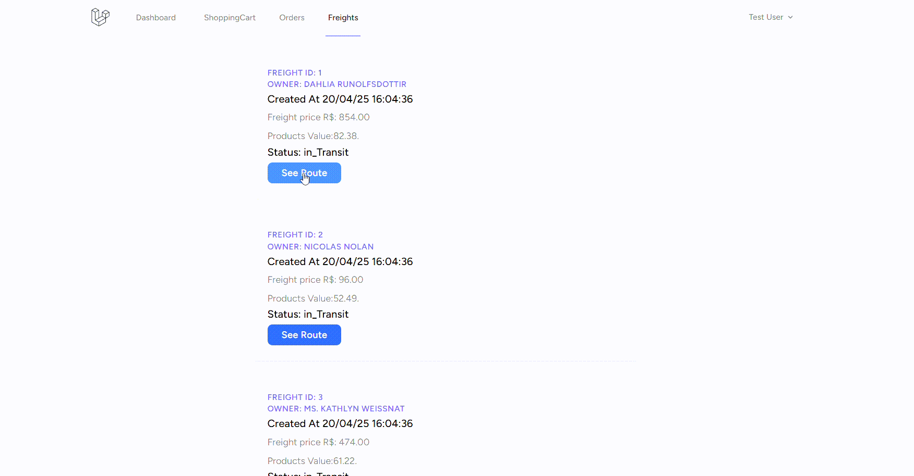

# 🪨 Mineradora – Gestão de Pedras, Areia e Brita

Sistema web completo vendas, logística de uma mineradora. Voltado para facilitar o fluxo de trabalho entre clientes, administradores e caçambeiros, integrando comunicação, pagamentos e operações logísticas em um só lugar.

---

## ✨ Features

- 🛒 **Gestão de pedidos:** Clientes podem fazer pedidos de brita, areia e outros materiais facilmente.
- 🛻 **Gestão de entregas:** Caçambeiros recebem notificações e atualizam status das entregas.
- 💳 **Integração com gateways de pagamento:** Pagamentos online com Pix [AbacatePay / Asaas].
- 📦 **Rota de Entrega:** Obtem a rota de entrega usando a API Routes do Google.
- 📦 **Cotação de Fretes:** Administradores cotam o valor do frete usando a Api do Melhor Envio.
- 🔄 **Webhooks integrados:** Processamento automático de callbacks de pagamento e atualização de status dos pedidos.
- 🧪 **Cobertura de testes de 95%**: Segurança e confiança com testes automatizados em quase todo o código.
- 🧠 **Autenticação e permissões:** Sistema robusto com múltiplos papéis: cliente, administrador e motorista.
- 🌐 **Responsivo e moderno:** Interface com Tailwind CSS e Vite, adaptável para desktop e mobile.

---

## 🎥 Demonstração

## Página Inicial


### 🛒 Criando um pedido | 💳 Pagando com gateway integrado


### 


### 📦 Motorista vendo os detalhes da entrega



---

## ⚙️ Instalação e Configuração

```bash
# Clonar o projeto
git clone https://github.com/RichardGL11/mineradora.git
cd mineradora

# Instalar dependências
composer install
npm install

# Copiar e configurar variáveis de ambiente
cp .env.example .env
php artisan key:generate

# Rodar migrações e seeders
php artisan migrate --seed

# Rodar o sistema
npm run dev
php artisan serve
